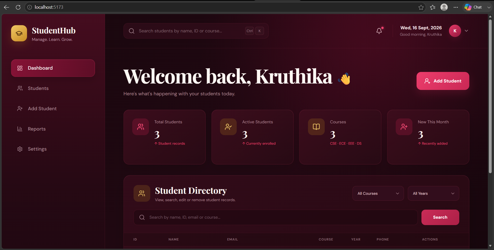
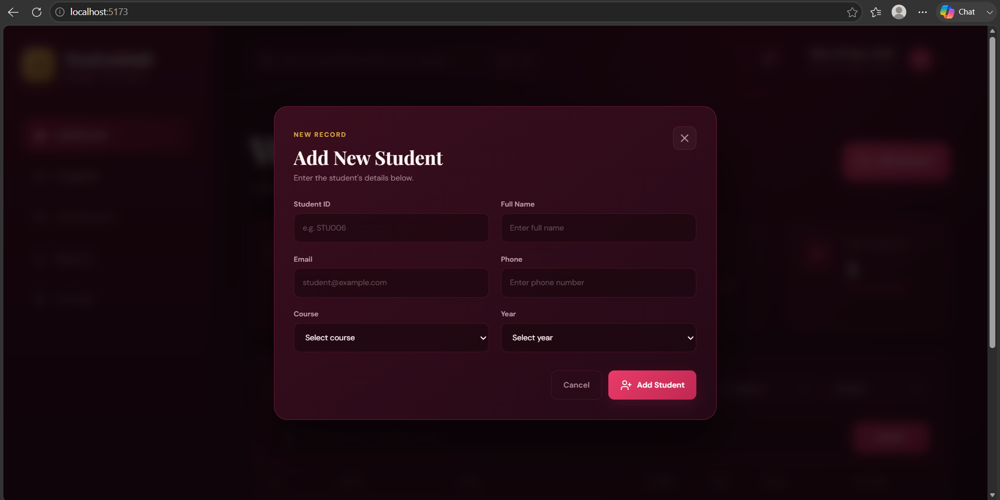
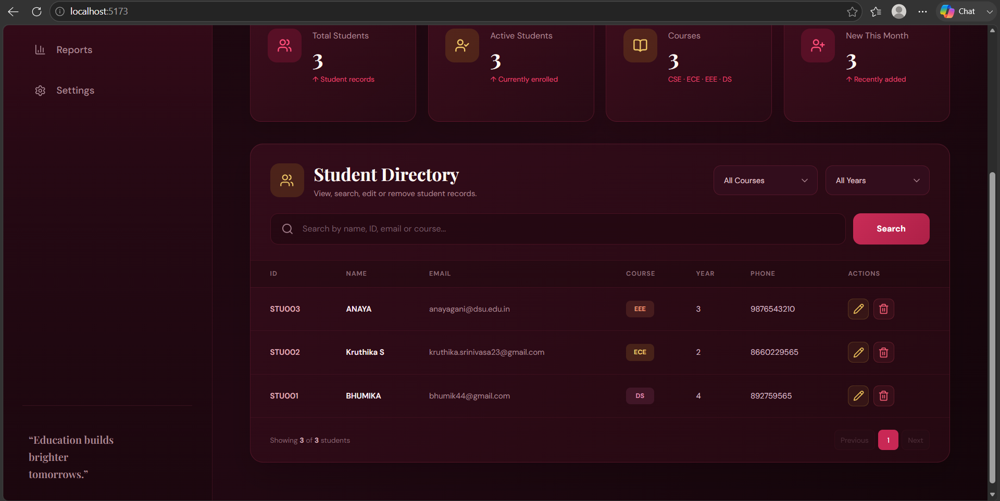
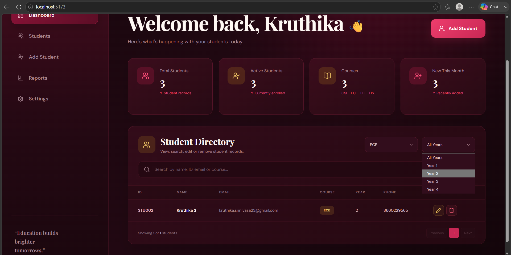
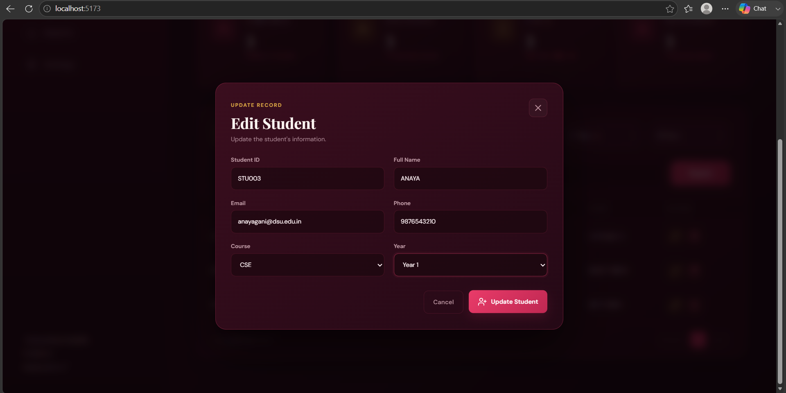
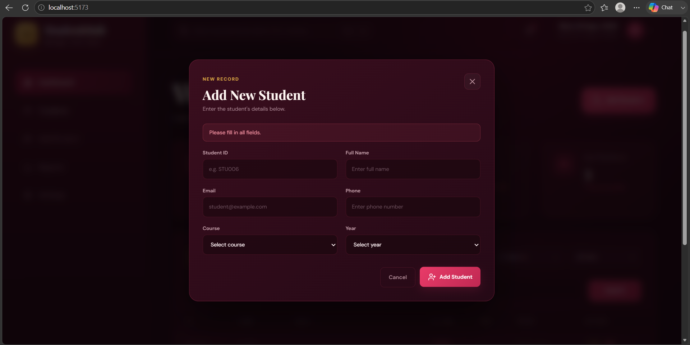

# 🎓 Student Management System

A full-stack Student Management System built using the MERN Stack for managing student records through a modern, responsive dashboard.

The application provides complete CRUD operations, student search, course and year filtering, form validation, duplicate Student ID protection, and persistent data storage using MongoDB Atlas.

---

## 📌 Project Overview

The Student Management System is a web-based application developed to simplify and organize student record management.

The system allows users to:

- Add new student records
- View student records
- Edit existing student information
- Delete student records
- Search students using multiple fields
- Filter students by course
- Filter students by academic year
- Apply combined filters
- Validate required student information
- Prevent duplicate Student IDs
- Store and retrieve student data from MongoDB

The project follows a full-stack architecture where the React frontend communicates with the Node.js and Express.js backend through REST APIs using Axios.

---

## 🚀 Live Demo

The Student Management System is deployed and accessible online.

### 🌐 Live Application

https://student-management-system-ijhy.onrender.com

### 🔗 Backend API

https://student-management-api-qjhd.onrender.com

### Deployment Stack

- **Frontend:** React + Vite deployed on Render
- **Backend:** Node.js + Express deployed on Render
- **Database:** MongoDB Atlas
- **Source Code:** GitHub

> **Note:** The application uses a free hosting tier, so the backend may take a short time to wake up after a period of inactivity.

---

## 🎯 Project Objectives

The main objectives of this project are:

- To develop a functional student record management system.
- To implement CRUD operations using the MERN stack.
- To connect a React frontend with a Node.js and Express.js backend.
- To store student information using MongoDB.
- To implement search and filtering functionality.
- To provide basic form and database validation.
- To create a clean and user-friendly dashboard interface.
- To understand the development and integration of a complete full-stack web application.

---

## ✨ Features

### 👤 Student Management

- Add new students
- View all students
- Edit student details
- Delete student records
- Persistent MongoDB data storage

### 🔎 Student Search

Students can be searched using:

- Student ID
- Student Name
- Email
- Course

### 🎯 Student Filtering

The Student Directory supports filtering by:

- Course
- Academic Year
- Course + Academic Year combination

### ✅ Validation

The application provides:

- Required-field validation
- Unique Student ID validation
- Course validation
- Academic year validation
- Backend Mongoose validation

### 📊 Dashboard

The dashboard displays:

- Total Students
- Active Students
- Number of Courses
- Recently added student records
- Student Directory

### 📄 Student Directory

The Student Directory provides:

- Student information table
- Search functionality
- Course filter
- Year filter
- Edit action
- Delete action
- Pagination
- Empty-state handling

### 🎨 User Interface

The application uses a modern Burgundy Luxe dashboard design featuring:

- Burgundy and wine-inspired color palette
- Gold accent elements
- Responsive layout
- Sidebar navigation
- Dashboard statistic cards
- Search interfaces
- Student management table
- Add/Edit student modal
- Interactive buttons
- Course badges
- Responsive styling

---

## 🏗️ Project Architecture

```text
                    Student Management System
                              │
                              ▼
                    ┌──────────────────┐
                    │  React Frontend  │
                    │      Vite        │
                    └────────┬─────────┘
                             │
                        Axios / REST API
                             │
                             ▼
                    ┌──────────────────┐
                    │ Node.js +        │
                    │ Express.js       │
                    └────────┬─────────┘
                             │
                          Mongoose
                             │
                             ▼
                    ┌──────────────────┐
                    │  MongoDB Atlas   │
                    └──────────────────┘
````

---

## 📁 Project Structure

```text
student-management-system/
│
├── client/
│   ├── public/
│   │
│   ├── src/
│   │   ├── components/
│   │   │   ├── Sidebar.jsx
│   │   │   ├── StatCard.jsx
│   │   │   ├── StudentDirectory.jsx
│   │   │   └── StudentForm.jsx
│   │   │
│   │   ├── App.jsx
│   │   ├── index.css
│   │   └── main.jsx
│   │
│   ├── package.json
│   └── vite.config.js
│
├── screenshots/
│   ├── 01-dashboard.png
│   ├── 02-add-student.png
│   ├── 03-student-directory.png
│   ├── 04-search-filter.png
│   ├── 05-edit-student.png
│   └── 06-validation.png
│
├── server/
│   ├── models/
│   │   └── Student.js
│   │
│   ├── routes/
│   │   └── studentRoutes.js
│   │
│   ├── server.js
│   └── package.json
│
├── .gitignore
├── package.json
├── package-lock.json
└── README.md
```

---

## 🛠️ Technology Stack

### Frontend

* **React.js** — User interface development
* **Vite** — Frontend development and build tool
* **Axios** — Communication with backend REST APIs
* **Lucide React** — Interface icons
* **CSS** — Styling and responsive design

### Backend

* **Node.js** — JavaScript runtime
* **Express.js** — REST API and server framework
* **Mongoose** — MongoDB object modeling
* **CORS** — Cross-origin request handling
* **dotenv** — Environment variable management

### Database

* **MongoDB Atlas** — Cloud database for student records

### Development & Version Control

* **Visual Studio Code**
* **Git**
* **GitHub**
* **npm**

---

## 🔄 CRUD Operations

The application implements complete CRUD functionality.

### Create

Users can add a new student through the Add Student form.

The student information is sent from the React frontend to the Express backend using Axios and stored in MongoDB.

### Read

Student records are retrieved from MongoDB through the Express REST API and displayed in the Student Directory.

### Update

Users can select the edit button for an existing student, modify the information, and save the changes.

The updated data is sent using a PUT request and stored in MongoDB.

### Delete

Users can delete an existing student record through the delete button.

A confirmation message is displayed before the record is removed.

---

## 🔗 REST API

### Local Development Base URL

```text
http://localhost:5000/api/students
```

### Production Base URL

```text
https://student-management-api-qjhd.onrender.com/api/students
```

### API Endpoints

| Method | Endpoint            | Description                 |
| ------ | ------------------- | --------------------------- |
| GET    | `/api/students`     | Retrieve all students       |
| GET    | `/api/students/:id` | Retrieve a specific student |
| POST   | `/api/students`     | Add a new student           |
| PUT    | `/api/students/:id` | Update a student            |
| DELETE | `/api/students/:id` | Delete a student            |

---

## 👨‍🎓 Student Data Model

Each student record contains the following fields:

| Field      | Type   | Required | Description               |
| ---------- | ------ | -------- | ------------------------- |
| Student ID | String | Yes      | Unique student identifier |
| Name       | String | Yes      | Student's full name       |
| Email      | String | Yes      | Student email address     |
| Phone      | String | Yes      | Student phone number      |
| Course     | String | Yes      | Student's course          |
| Year       | String | Yes      | Academic year             |

### Supported Courses

* CSE
* ECE
* EEE
* DS

### Supported Academic Years

* Year 1
* Year 2
* Year 3
* Year 4

---

## 🔍 Search and Filtering

The Student Directory provides a search feature that allows users to search student records by:

* Student ID
* Name
* Email
* Course

The application also provides filters for:

* Course
* Academic Year

Course and year filters can be applied together to narrow down the displayed student records.

---

## ✅ Validation

Validation is implemented to improve data quality and prevent invalid student records.

### Frontend Validation

The student form checks that all required fields are completed before submission.

If required fields are missing, the user receives an error message.

### Backend Validation

The Mongoose schema validates:

* Required fields
* Unique Student ID
* Allowed courses
* Allowed academic years

### Duplicate Student ID

Student IDs are configured as unique.

If a duplicate Student ID is submitted, the backend returns an appropriate validation message and prevents duplicate records from being created.

---

## 🧪 Testing

The application was tested for the following functionality:

* Add Student
* View Students
* Edit Student
* Delete Student
* Search by Student Name
* Search by Student ID
* Search by Email
* Search by Course
* Course Filter
* Year Filter
* Combined Course + Year Filter
* Empty-field Validation
* Duplicate Student ID Validation
* MongoDB Data Persistence
* Data Persistence After Browser Refresh
* Live Deployment Testing

All core CRUD, search, filtering, validation, database persistence, and deployment functionality was tested successfully.

---

## 🖥️ Application Workflow

```text
User
 │
 ▼
React Dashboard
 │
 ├── Add Student
 │
 ├── View Students
 │
 ├── Search Students
 │
 ├── Filter Students
 │
 ├── Edit Student
 │
 └── Delete Student
 │
 ▼
Axios
 │
 ▼
Express REST API
 │
 ▼
Mongoose
 │
 ▼
MongoDB Atlas
```

---

## 🔐 Security

Sensitive database configuration is handled through environment variables and is not committed to the public repository.

Sensitive credentials should never be committed to GitHub.

The repository's `.gitignore` is configured to prevent sensitive environment configuration from being tracked.

---

## 🚀 Getting Started

Follow the steps below to run the project locally.

### 1. Clone the Repository

```bash
git clone https://github.com/kruthikasrinivasa/student-management-system.git
```

Navigate into the project:

```bash
cd student-management-system
```

### 2. Install Frontend Dependencies

Navigate to the client directory:

```bash
cd client
```

Install the required packages:

```bash
npm install
```

### 3. Install Backend Dependencies

Open another terminal.

Navigate to the server directory:

```bash
cd server
```

Install the required packages:

```bash
npm install
```

### 4. Configure MongoDB

The backend requires a MongoDB Atlas connection to store student records.

Configure the required database connection settings locally before starting the backend.

Do not commit database credentials or sensitive configuration to GitHub.

---

## ▶️ Running the Backend

From the `server` directory, run:

```bash
node server.js
```

The backend will run on:

```text
http://localhost:5000
```

A successful connection displays messages similar to:

```text
MongoDB connected successfully
Server running on http://localhost:5000
```

---

## ▶️ Running the Frontend

From the `client` directory, run:

```bash
npm run dev
```

The frontend will run on:

```text
http://localhost:5173
```

Open the displayed URL in your browser to access the application.

---

## 📱 Responsive Design

The dashboard includes responsive CSS styling to support different screen sizes.

The interface adapts to:

* Desktop screens
* Tablets
* Smaller screens

The student table also supports horizontal scrolling when required on smaller displays.

---

## 📸 Screenshots

The following screenshots demonstrate the main features and functionality of the Student Management System.

### 🏠 Dashboard

The main dashboard provides an overview of student records, statistics, navigation, and the Student Directory.



---

### ➕ Add Student

The Add Student form allows users to enter and save new student information.



---

### 👨‍🎓 Student Directory

The Student Directory displays student records along with options to search, filter, edit, and delete records.



---

### 🔎 Search and Filtering

Students can be searched using Student ID, name, email, or course and filtered by course and academic year.



---

### ✏️ Edit Student

The Edit Student form allows users to update existing student information.



---

### ✅ Validation

The application provides validation for incomplete fields and duplicate Student IDs.



---

## 🌐 Deployment

The application is deployed using the following architecture:

```text
GitHub
   │
   ├── React Frontend
   │       │
   │       ▼
   │     Render
   │
   └── Node.js + Express Backend
           │
           ▼
         Render
           │
           ▼
      MongoDB Atlas
```

### Deployment URLs

**Live Application**

[https://student-management-system-ijhy.onrender.com](https://student-management-system-ijhy.onrender.com)

**Backend API**

[https://student-management-api-qjhd.onrender.com](https://student-management-api-qjhd.onrender.com)

---

## 📚 Learning Outcomes

This project provided practical experience in:

* React component development
* React state management
* React forms
* REST API development
* Express.js routing
* Node.js backend development
* MongoDB database integration
* Mongoose schemas
* Mongoose validation
* Axios API communication
* CRUD operations
* Search functionality
* Filtering
* Form validation
* Error handling
* Responsive UI development
* Git and GitHub version control
* Full-stack application architecture
* Application deployment

---

## 🔮 Future Enhancements

The system can be extended with additional features such as:

* User authentication
* Role-based access control
* Student profile pages
* Student profile photographs
* Attendance management
* Academic performance tracking
* Export student records to CSV or PDF
* Dashboard analytics and charts
* Server-side pagination
* Advanced server-side search
* Notification system

---

## 📂 Repository

### GitHub Repository

[https://github.com/kruthikasrinivasa/student-management-system](https://github.com/kruthikasrinivasa/student-management-system)

---

## 👩‍💻 Author

**Kruthika S**

B.Tech Computer Science and Engineering (Data Science)

Dayananda Sagar University

---

## 📄 Project Information

| Category          | Details                   |
| ----------------- | ------------------------- |
| Project           | Student Management System |
| Project Type      | Internship Mini Project   |
| Technology        | MERN Stack                |
| Frontend          | React.js + Vite           |
| Backend           | Node.js + Express.js      |
| Database          | MongoDB Atlas             |
| API Communication | Axios                     |
| Version Control   | Git + GitHub              |
| Deployment        | Render                    |

---

## 📜 License

This project was developed as an internship mini-project for educational and learning purposes.

```
```
